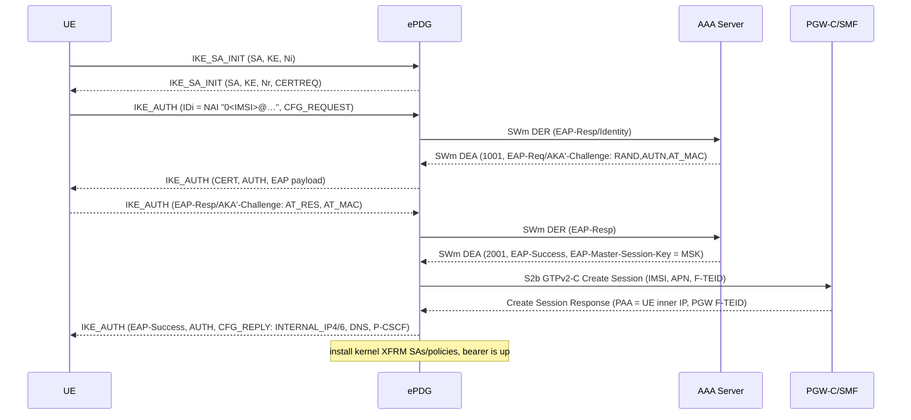

# ePDG (Evolved Packet Data Gateway)

Native Erlang/OTP **Evolved Packet Data Gateway** (3GPP TS 23.402) that
terminates the SWu IKEv2/IPsec tunnel from a UE on untrusted non-3GPP
access (Wi-Fi) and anchors the PDN connection to the EPC, enabling
**VoWiFi** per GSMA IR.51 / IR.92.

The ePDG is **peer-agnostic on its core-facing interfaces**: it
authenticates the UE with EAP-AKA' over the SWm Diameter interface to any
TS 29.273-conformant 3GPP AAA Server (typically reached through a DRA), and
sets up the user-plane bearer over GTPv2-C/GTP-U (S2b) toward any
TS 29.274 PGW-C/SMF (Open5GS SMF in our deployments).

The IKEv2/IPsec stack is implemented natively in Erlang (no strongSwan);
the data plane is programmed into the Linux kernel XFRM subsystem, so the
BEAM is out of the per-packet path once Child SAs are installed.

---

## Scope and standards

| Area | Standard |
|------|----------|
| Non-3GPP access architecture (S2b) | 3GPP TS 23.402 |
| Tunnel mode / UE attach procedures | 3GPP TS 24.302 |
| Non-3GPP access security | 3GPP TS 33.402 |
| SWm (ePDG ↔ AAA) — untrusted non-3GPP | 3GPP TS 29.273 §7 |
| GTPv2-C S2b (ePDG ↔ PGW-C/SMF) | 3GPP TS 29.274 |
| GTP-U S2b-U user plane | 3GPP TS 29.281 |
| ePDG / APN FQDN formats | 3GPP TS 23.003 §19.4, §14 |
| IKEv2 | IETF RFC 7296 |
| EAP-only authentication in IKEv2 | IETF RFC 5998 |
| IKEv2 NAT traversal (UDP-encap ESP) | IETF RFC 3948 |
| MOBIKE (Wi-Fi ↔ Wi-Fi handover) | IETF RFC 4555 |
| IKEv2 Redirect (load steering on drain) | IETF RFC 5685 |
| EAP | IETF RFC 3748 |
| EAP-AKA | IETF RFC 4187 |
| EAP-AKA' | IETF RFC 5448 |
| Diameter base protocol | IETF RFC 6733 |

---

## Component architecture

```
        SWu: IKEv2/IPsec (EAP-AKA')                SWm (Diameter, App 16777264)
 +------+  ===========================>  +-------+  ----------->  +-----+        +-----+
 |  UE  |  <---------- ESP ------------   | ePDG  |  <----------   | DRA |--SWx-->| AAA |--->HSS
 +------+                                 +-------+               +-----+        +-----+
                                          |   ^
                          S2b-U GTP-U     |   |   S2b GTP-C v2 (TS 29.274)
                          (TS 29.281)     v   |
                                       +-----------+
                                       | PGW-C/SMF |  ---> P-GW-U / UPF ---> IMS (P-CSCF)
                                       +-----------+
```

A single Erlang/OTP application owns the whole signalling plane; a per-UE
`gen_statem` drives one IKEv2/IPsec tunnel each. The kernel handles ESP
(XFRM); GTP-U encapsulation runs in the userspace forwarder behind one
shared TUN device per pod (`epdg<N>`, `epdg0` for a single instance — see
[`EPDG_INSTANCE_ID`](#multiple-epdg-pods-per-node-epdg_instance_id)) for
all UE bearers, with uplink attributed to its bearer by the inner source
IP.

### Key modules

| Module | Responsibility |
|--------|----------------|
| `epdg_ikev2_listener` | UDP sockets on 500 (IKE) and 4500 (NAT-T); dispatches datagrams to UE FSMs |
| `epdg_ikev2_codec` | IKEv2 header/payload encode + decode, proposal selection (RFC 7296) |
| `epdg_ikev2_crypto` | DH/ECDH, PRF, AES-GCM/AES-CBC, EAP-AKA' key derivation (CK'/IK', MSK, SK_*) |
| `epdg_ue_fsm` | Per-UE `gen_statem`: `idle → ike_sa_init → ike_auth → established`; DPD, MOBIKE, teardown |
| `epdg_ue_sup` | `simple_one_for_one` dynamic supervisor spawning one FSM per UE |
| `epdg_ue_registry` | ETS maps: SPI → FSM pid, IMSI → SPI; drain broadcast |
| `epdg_diameter_swm` | SWm Diameter client (DER/STR) toward the AAA via one transport per DRA replica |
| `epdg_gtpc_client` | S2b GTP-C v2 Create/Delete Session; Echo heartbeat, FQDN re-resolve, restart detection |
| `epdg_gtpc_codec` | GTPv2-C message/IE encode + decode (TS 29.274) |
| `epdg_gtpu_forwarder` | Userspace GTP-U bridge (per-instance shared TUN `epdg<N>` ↔ S2b-U socket); uplink keyed by inner source IP, downlink demuxed by TEID |
| `epdg_xfrm` | Linux kernel IPsec SA/SP programming; hardware-offload detection |
| `epdg_dns_cache` | TTL-aware DNS cache used by the GTP-C client for PGW FQDN resolution |
| `epdg_config` | Environment-variable driven configuration |
| `epdg_http` / `epdg_http_handler` | Cowboy API: `/healthz`, `/readyz`, `/metrics`, `/api/status`, `/admin/*` |
| `epdg_metrics` | Prometheus-style counters/gauges in ETS (`epdg_*`) |

### Supervision tree (`epdg_sup`, `one_for_one`)

```
epdg_ue_registry  →  epdg_dns_cache  →  epdg_xfrm  →  epdg_gtpc_client
   →  epdg_gtpu_forwarder  →  epdg_diameter_swm  →  epdg_ikev2_listener
   →  epdg_ue_sup (dynamic)  →  epdg_http
```

Order matters: the DNS cache starts before the GTP-C client so the first
PGW resolution is served from cache, and listeners come up only after the
data-plane and Diameter workers are ready.

---

## Reference points

| Interface | Peer | Transport | Purpose |
|-----------|------|-----------|---------|
| **SWu** | UE | IKEv2 / ESP over UDP 500 + 4500 | Tunnel establishment, EAP-AKA' auth, inner IP config |
| **SWm** | AAA Server (via DRA) | Diameter, App-Id 16777264, Vendor 10415 | Relay EAP, retrieve MSK, anchor/release session |
| **S2b (control)** | PGW-C / SMF | GTPv2-C, UDP 2123 | Create/Delete Session, bearer + PAA, Echo |
| **S2b-U (user)** | PGW-U / UPF | GTP-U, UDP 2152 | Subscriber data plane |

### SWm message matrix — App-Id 16777264, Vendor 10415

| Direction | Command | Purpose |
|-----------|---------|---------|
| ePDG → AAA | DER (268) | Relay EAP-Response (Identity, then AKA'-Challenge) |
| AAA → ePDG | DEA (268) | EAP-Request/AKA'-Challenge (1001) or EAP-Success + `EAP-Master-Session-Key` (2001) |
| ePDG → AAA | STR (275) | Release the non-3GPP session on tunnel teardown |
| AAA → ePDG | STA (275) | Confirmed |
| AAA → ePDG | ASR (274) / RAR (258) | HSS-initiated detach / profile refresh — **not yet honoured** (answered `DIAMETER_UNABLE_TO_DELIVER` 3001) |

The DER also carries the UE's real outer (NAT'd) `UE-Local-IP-Address`
(TS 29.273 §9.2.3.1.1) so the AAA and HSS-GUI can surface it per IMSI.

---

## IKEv2 / EAP-AKA' bring-up



After `established`, the BEAM only handles control traffic (DPD, MOBIKE,
GTP-C Echo, teardown); ESP ↔ GTP-U runs in the kernel.

### EAP-only authentication (RFC 5998)

When a UE includes `N(EAP_ONLY_AUTHENTICATION)` (16417) in the first
`IKE_AUTH` request, it is willing to authenticate the ePDG without a
certificate and to rely on the EAP-AKA' MSK-based AUTH that already
runs in the final exchange. Samsung handsets offer this notify and
reject self-signed or custom-CA certificates even when the CA is
installed on the UE — so honouring the offer is what makes Samsung
work for an operator whose certificate is not in Samsung's trust store.
An operator with a valid, already-trusted certificate loses little by
honouring it: RFC 5998 §6.2 notes that the UE then knows it talks to
*a* gateway trusted by its home AAA, not necessarily *this* one. EAP-AKA'
is mutually authenticating and key-generating, which is the precondition
RFC 5998 §3 sets. `EPDG_EAP_ONLY_AUTH=false` restores strict RFC 7296
behaviour: the notify is ignored and CERT + AUTH are always sent. The
ePDG certificate and key are **still required at boot** in both modes;
EAP-only only skips sending them on message 4.

---

## Configuration

All configuration is read from environment variables (`epdg_config.erl`).
Empty/unset values fall back to the defaults below.

### Identity / PLMN / logging

| Variable | Default | Purpose |
|----------|---------|---------|
| `EPDG_ORIGIN_HOST` | `$HOSTNAME.$EPDG_ORIGIN_REALM` or `epdg.localdomain` | Diameter Origin-Host |
| `EPDG_ORIGIN_REALM` | `localdomain` | Diameter Origin-Realm |
| `MCC` | `001` | PLMN MCC (builds NAIs / IDr FQDN) |
| `MNC` | `01` | PLMN MNC |
| `EPDG_LOG_LEVEL` | `notice` | `debug` / `info` / `notice` / `warning` / `error`. `notice` emits the per-attach `proposal #N proto=… transforms=…` dump; the logger formatter is pinned so OTP does not truncate it (a mid-token cut is journald `LineMax`, a terminal wrap, or the paste) |

### IKEv2 / IPsec

| Variable | Default | Purpose |
|----------|---------|---------|
| `EPDG_IKE_BIND_ADDR` | `0.0.0.0` | IKE/NAT-T bind address (see per-pod/per-node maps below) |
| `EPDG_IKE_PORT` | `500` | IKE listener port |
| `EPDG_IKE_NATT_PORT` | `4500` | NAT-T (UDP-encapsulated ESP) port |
| `EPDG_IKE_CERT_FILE` | _(empty)_ | PEM X.509 certificate the ePDG presents (TS 33.402 §7.2.1) |
| `EPDG_IKE_KEY_FILE` | _(empty)_ | PEM private key matching the certificate |
| `EPDG_IKE_ID_FQDN` | `epdg.epc.mnc<MNC>.mcc<MCC>.3gppnetwork.org` | IDr FQDN (should match the cert SAN:DNS) |
| `EPDG_IKE_LEGACY_DH_GROUPS` | _(empty)_ | Comma-separated opt-in for legacy DH groups `2` (MODP-1024) and/or `5` (MODP-1536). **Off by default**: RFC 8247 §2.4 rates both as SHOULD NOT — MODP-1024 in particular is within reach of well-funded attackers (Logjam). Enable only for a known legacy device population that offers no stronger group; a built-in group (14/15/16/19/20/31) offered anywhere in the proposal still wins. Enabling logs a warning at boot |
| `EPDG_EAP_METHOD` | `aka-prime` | `aka` or `aka-prime` |
| `EPDG_EAP_ONLY_AUTH` | `true` | Honour RFC 5998 `N(EAP_ONLY_AUTHENTICATION)` and omit CERT + signature AUTH from IKE_AUTH message 4. `false` restores strict RFC 7296 (always send CERT+AUTH) |
| `EPDG_IPSEC_OFFLOAD` | `auto` | `auto` / `none` / `inline` / `crypto` |
| `EPDG_IPSEC_IFACE` | `eth0` | NIC for hardware-offload detection |

### Dead Peer Detection (RFC 7296 §2.4)

| Variable | Default | Purpose |
|----------|---------|---------|
| `EPDG_DPD_INTERVAL` | `120000` | Idle interval between DPD probes (ms) — deliberately patient for NAT'd VoWiFi UEs |
| `EPDG_DPD_TIMEOUT` | `10000` | Per-probe response timeout (ms) |
| `EPDG_DPD_RETRIES` | `3` | Consecutive unanswered probes before teardown |

### MOBIKE return-routability (RFC 4555 §3.7)

| Variable | Default | Purpose |
|----------|---------|---------|
| `EPDG_MOBIKE_RR_CHECK` | `true` | Require a COOKIE2 echo from the new outer address before moving kernel SAs |
| `EPDG_MOBIKE_RR_TIMEOUT` | `3000` | Per-probe wait for the COOKIE2 echo (ms) |
| `EPDG_MOBIKE_RR_RETRIES` | `2` | COOKIE2 probe retransmits before abandoning the move |

### IKEv2 Redirect (RFC 5685)

Responder-only. On a graceful drain, a UE that advertised `N(REDIRECT_SUPPORTED)`
in its `IKE_SA_INIT` is steered to a healthy node before its SA is torn down.
The `DELETE` fallback and drain jitter are always kept, so unsupported UEs and
the local/S2b/SWm teardown are unaffected.

| Variable | Default | Purpose |
|----------|---------|---------|
| `EPDG_REDIRECT_ENABLE` | `false` | Send an RFC 5685 `REDIRECT` to draining UEs that advertised `REDIRECT_SUPPORTED`, before the `DELETE` |
| `EPDG_REDIRECT_TARGET` | _(empty)_ | Gateway the UE should move to. **Prefer an FQDN**: a literal IP sends every draining UE to one node and recreates the thundering herd the drain jitter exists to prevent, whereas an FQDN lets DNS spread arrivals across the remaining healthy pods |

### GTP-C / GTP-U S2b (TS 29.274 / TS 29.281)

| Variable | Default | Purpose |
|----------|---------|---------|
| `PGW_FQDN` | _(empty)_ | Preferred: PGW-C/SMF FQDN, re-resolved on TTL/failure/Echo timeout |
| `PGW_ADDR` | `127.0.0.1` | Static fallback PGW address (logs a warning; bare-metal/single-node) |
| `PGW_PORT` | `2123` | PGW-C GTP-C port |
| `EPDG_GTPC_BIND_ADDR` | `0.0.0.0` | Local GTP-C bind address |
| `EPDG_GTPC_PORT` | `2123` | Local GTP-C port |
| `EPDG_GTPC_ECHO_INTERVAL_SEC` | `60` | GTP-C Echo heartbeat interval |
| `EPDG_GTPC_ECHO_TIMEOUT_SEC` | `3` | Echo response timeout |
| `EPDG_GTPC_ECHO_MAX_MISSES` | `3` | Missed Echoes before the peer is declared down |
| `EPDG_GTPC_BACKOFF_MAX_SEC` | `30` | Max reconnect backoff |
| `EPDG_GTPC_MAX_DOWN_SEC` | `30` | Max time a peer may stay down before pending calls fail |
| `EPDG_GTPC_PENDING_LIMIT` | `16` | Bounded queue of in-flight Create/Delete while reconnecting |
| `EPDG_DNS_MIN_TTL_SEC` | `5` | DNS cache TTL floor |
| `EPDG_DNS_MAX_TTL_SEC` | `60` | DNS cache TTL ceiling |
| `EPDG_GTPU_BIND_ADDR` | `0.0.0.0` | Local GTP-U bind address |
| `EPDG_GTPU_ADVERTISE_ADDR` | _(empty)_ | IP put in the S2b-U F-TEID; empty = local GTP-C IP |
| `EPDG_GTPU_PORT` | `2152` | GTP-U port (TS 29.281 fixed port) |

The IKE and GTP-U bind/advertise addresses additionally accept
`<name>=<ip>` CSV override maps via `*_BY_POD` (matched on `HOSTNAME`) and
`*_BY_NODE` (matched on `NODE_NAME`), used for `hostNetwork` active-active
deployments. Precedence: per-pod → per-node → scalar → default.

### Multiple ePDG pods per node (`EPDG_INSTANCE_ID`)

| Variable | Default | Purpose |
|----------|---------|---------|
| `EPDG_INSTANCE_ID` | _(derived)_ | Explicit pod instance id, integer `0..63`. Any other value fails the boot |

In `hostNetwork` active-active deployments every ePDG pod on a node shares
the node's network namespace. The shared-TUN datapath identifiers are
therefore derived from a per-pod **instance id**:

* TUN device: `epdg<id>` (`epdg0`, `epdg1`, …)
* policy-routing table: `100 + id` (100..163)
* `ip rule` priority: `1000 + id` (1000..1063 — always strictly between
  the PGW-U escape rules at 900 and the main table at 32766)

Without distinct ids, two pods on one node would attach to the same
`epdg0` device, overwrite each other's rules, and a stopping pod would
tear down the running pod's entire datapath.

The id is resolved in this order:

1. `EPDG_INSTANCE_ID` — explicit integer `0..63`; anything else refuses
   to boot.
2. `POD_NAME` — a StatefulSet name with an ordinal suffix (`epdg-0`,
   `epdg-1`) uses the ordinal (mod 64); any other name is hashed stably
   into `0..63`. The epdg-chart injects `POD_NAME` automatically.
3. `0` — single instance / local development.

The forwarder logs the resolved mapping at startup
(`GTP-U datapath instance N: TUN epdgN, routing table T, rule priority P`)
so node state can be attributed to pods without guessing. **Two ePDG pods
scheduled onto the same node must resolve to different ids** — with
StatefulSet ordinals or explicit per-pod `EPDG_INSTANCE_ID` values this
holds by construction; with hashed names it holds with high probability,
but pin `EPDG_INSTANCE_ID` explicitly if you run non-ordinal pod names on
shared nodes.

### Diameter SWm (toward AAA via DRA)

| Variable | Default | Purpose |
|----------|---------|---------|
| `DRA_HOSTS` | _(unset)_ | Comma-separated DRA peers (takes precedence over `DRA_HOST`) |
| `DRA_HOST` | `dra-diameter` | Legacy single-DRA fallback |
| `DRA_PORT` | `3868` | DRA Diameter port |
| `DRA_TRANSPORT` | `tcp` | `tcp` or `sctp` |
| `EPDG_DIAMETER_PORT` | `3868` | Local Diameter port |
| `EPDG_SWM_DEST_REALM` | _(Origin-Realm)_ | Destination-Realm for routed SWm DERs (the AAA realm) |
| `EPDG_SWM_RAT_TYPE` | `0` | RAT-Type in SWm DER (`0` = WLAN, TS 29.273 §5.2.3.6) |

### UE addressing / APN / dual-stack

| Variable | Default | Purpose |
|----------|---------|---------|
| `EPDG_UE_IP_POOLS` | **required** | Comma-separated CIDR list (IPv4/IPv6 mixed) of every UE inner-IP pool the PGW allocates from, e.g. `10.46.0.0/16,cafe:0:46::/48`. Drives the shared-TUN policy routing and the register-time pool check; the app refuses to boot without it. IPv6 pools must be **wider than /64** (uplink attribution is keyed on the per-UE delegated /64, so a `/64`-or-longer pool could hold only one distinguishable UE and is rejected at boot). Replaces the never-evaluated `EPDG_UE_IP_POOL`/`EPDG_UE_IP6_POOL` |
| `EPDG_IPV6_ENABLED` | `false` | Honour the UE's requested PDN type and grant IPv6 / IPv4v6 (IR.51/IR.92). An IPv6 PDN is a **/64 prefix**, not a host address: the UE forms its own interface identifier inside it, so the inner XFRM selectors and the uplink bearer lookup both key on the /64. `EPDG_UE_IP_POOLS` must contain the prefixes the PGW allocates from, and the PGW must return an IPv6 P-CSCF in the PCO for an IPv6-only PDN |
| `EPDG_ALLOWED_APNS` | `ims` | Comma-separated allow-list (empty = allow all; `ims` always allowed) |
| `EPDG_DEFAULT_APN` | `ims` | APN used when the UE does not request one |

### Miscellaneous

| Variable | Default | Purpose |
|----------|---------|---------|
| `EPDG_API_PORT` | `8080` | HTTP API port |

---

## HTTP endpoints

Served by Cowboy on `EPDG_API_PORT` (default 8080).

| Path | Method | Purpose |
|------|--------|---------|
| `GET /healthz` | GET | Liveness — 200 while the VM is up |
| `GET /readyz` | GET | Readiness — 200 only when not draining **and** ≥ 1 SWm Diameter peer is connected; else 503 |
| `GET /metrics` | GET | Prometheus exposition (`epdg_*` counters / gauges) |
| `GET /api/status` | GET | JSON — active/total sessions, tunnels, offload mode, peer count, drain flag |
| `GET /admin/sessions` | GET | JSON list of active UE sessions incl. real outer `peer_ip`/`peer_port` |
| `POST /admin/drain` | POST | Begin a graceful drain (preStop hook); flips the readiness flag and tears tunnels down with jitter |

---

## Metrics

`/metrics` exposes ETS-backed counters/gauges prefixed `epdg_`, including:

* `epdg_ikev2_packets_received_total`, `epdg_ike_tunnels_established_total`,
  `epdg_ike_auth_success_total` / `_failure_total`, `epdg_ike_auth_duration_ms_*`
* `epdg_ue_sessions_active` (gauge), `epdg_ue_sessions_total`,
  `epdg_session_superseded_total`
* `epdg_gtpc_requests_total` / `_responses_total` / `_timeouts_total`,
  `epdg_gtpc_latency_ms_*`, `epdg_gtpc_echo_*`, `epdg_gtpc_peer_down_total`,
  `epdg_gtpc_peer_restarts_total`, `epdg_gtpc_dns_resolves_total`
* `epdg_gtpu_tx_bytes` / `_rx_bytes` / `_tx_pkts` / `_rx_pkts`,
  `epdg_gtpu_peer_down_total`, `epdg_gtpu_uplink_unknown_src_total`,
  `epdg_ue_ip_outside_pool_total`, `epdg_ue_inner_ip_key_collision_total`
  (two different subscribers mapped onto one uplink inner-IP key — check
  the PGW address allocation)
* `epdg_gtpu_echo_req_rx_total` / `epdg_gtpu_echo_rsp_tx_total` — user-plane
  path supervision from the PGW-U. These must track each other; a growing gap
  (or a flat `req_rx` while the PGW logs GTP-U path timeouts) means our echo
  replies are not reaching it. `epdg_gtpu_rx_undecodable_total` counts
  datagrams on 2152 that are neither a T-PDU nor an echo
* `epdg_diameter_swm_requests_total`, `epdg_diameter_swm_latency_ms_*`,
  `epdg_diameter_swm_peers` (gauge)
* `epdg_xfrm_sa_active` (gauge), `epdg_xfrm_sa_created_total` / `_deleted_total` / `_errors_total`
* `epdg_dpd_probes_sent_total`, `epdg_dpd_timeout_total`
* `epdg_mobike_update_total`, `epdg_mobike_rr_check_total`, `epdg_mobike_rr_fail_total`
* `epdg_tun_startup_cleaned_total`

---

## Data plane (kernel XFRM + GTP-U)

Once Child SAs are negotiated at the end of `IKE_AUTH`, the ePDG installs an
inbound/outbound ESP SA pair plus matching XFRM policies in the Linux kernel
(`epdg_xfrm`). NAT-traversed sessions use UDP encapsulation on 4500 per
RFC 3948. Each session's SA pair and policies are tagged with a unique
`reqid` (the responder Child-SA SPI) so two UEs sharing one public IP
(carrier-grade NAT, or two handsets behind one home router) don't clobber
each other's state. Uplink cleartext is steered by pool-wide policy rules
(`EPDG_UE_IP_POOLS`) into the pod's shared TUN (`epdg<N>`, see
`EPDG_INSTANCE_ID` above), where the GTP-U forwarder
attributes each packet to its bearer by inner source IP and encapsulates it
toward the PGW-U; downlink GTP-U is TEID-checked, written back through the
same TUN and re-encrypted to the UE's outer address. The kernel owns all
ESP crypto; the BEAM owns GTP-U encap/decap. Registering a UE is pure
bookkeeping — the routing state is constant in the number of pools, not
sessions.

Hardware ESP offload (Mellanox ConnectX `mlx5`, Intel `ice`/QAT) is detected
via `ethtool` and used when available, with graceful fallback to software
ESP (AES-NI). See the platform docs for the full data-path walkthrough.

---

## Deployment notes

* **Capabilities:** runs **unprivileged** with only `NET_ADMIN` + `NET_RAW`
  (XFRM SA/SP + raw sockets). No `SYS_MODULE`, no kernel module loading.
* **Ports:** UDP 500, UDP 4500 (IKE/NAT-T), UDP 2123 (GTP-C), UDP 2152
  (GTP-U), TCP/SCTP 3868 (SWm), TCP 8080 (HTTP API).
* **Session affinity:** every IKE message in a session must reach the pod
  holding the SA state. Front the external IKE service with a LoadBalancer
  using `sessionAffinity: ClientIP` (NAT may remap the UE source port
  between `IKE_SA_INIT` and `IKE_AUTH`).
* **Graceful drain:** `POST /admin/drain` (preStop) marks the pod not-ready
  so the LB de-registers it, stops accepting new `IKE_SA_INIT`, and tears
  remaining tunnels down with jitter, releasing S2b GTP and SWm STR cleanly.
  With `EPDG_REDIRECT_ENABLE` set, a UE that advertised `REDIRECT_SUPPORTED`
  is first sent an RFC 5685 `REDIRECT` toward `EPDG_REDIRECT_TARGET` (ideally
  an FQDN) to steer it to a healthy node; the pod then still `DELETE`s the SA
  and tears down S2b/SWm. UEs that did not advertise support fall back to
  `DELETE` + DPD.
* **Shutdown deadline:** `kernel.shutdown_timeout` (`sys.config`) is 20 s so
  post-SIGTERM teardown fits inside the K8s grace buffer.

This image is deployed by the `epdg-chart` Helm chart as a StatefulSet.

---

## Build

```sh
# Compile (runs scripts/compile-diameter-dicts.sh to generate the SWm
# Diameter dictionary from priv/dict/swm.dia first)
rebar3 compile

# Production release (self-contained, with ERTS)
rebar3 as prod release

# Bump the version across VERSION + rebar.config + app.src (and tag)
./Bump.sh patch     # or: minor | major | rc | release
```

The Docker image (`docker/Dockerfile`, `erlang:26-alpine`) builds the
release and additionally compiles `apps/epdg/c_src/epdg_tun_port.c` — a tiny
stdio bridge the GTP-U forwarder uses to plumb the shared TUN device to the
GTP-U socket.

---

## Limitations / roadmap

* **AAA-initiated detach** (SWm ASR / RAR) is not yet honoured; such
  requests are answered with `DIAMETER_UNABLE_TO_DELIVER` (3001).
* **No automated CT suite** yet; testing is currently manual / integration
  (IKEv2 against real UEs, GTP-C against Open5GS). Adding `rebar3 ct`
  coverage for the IKEv2 and Diameter codecs is a roadmap item.
* `epdg_xfrm` drives the kernel via `ip xfrm`/`ip tuntap` commands;
  migrating to a native `gen_netlink` path is planned.

---

## Further documentation

The platform documentation has an in-depth ePDG page covering the full
IPsec data-path walkthrough, dual-stack handling, `hostNetwork`
active-active layout, certificate provisioning and troubleshooting:
`docs/docs/components/epdg.md` in the umbrella repository.

---

## License

Part of the CNaaS VoLTE / VoWiFi distribution. See root `LICENSE`.
